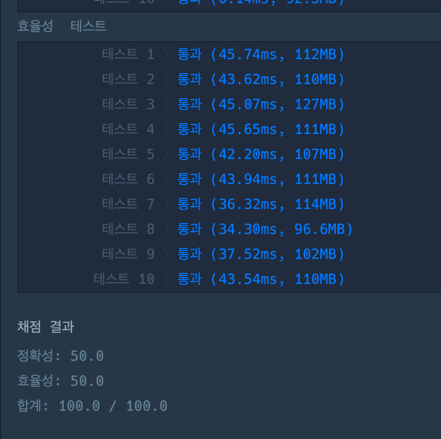

### 풀이 코드
```java
import java.util.*;

class Solution {
    public int solution(int[] money) {
        int answer = 0;
        int n = money.length;
        
        int[] first_start = new int[money.length + 1];
        first_start[0] = 0;
        
        int[] dp_first = new int[money.length];
        Arrays.fill(dp_first, 0);
        for(int i = 1; i < money.length; i++) {
            first_start[i] = money[i-1];
        }
        
        for(int i = 0; i < first_start.length - 1; i++) {
            if(i >= 2) {
              dp_first[i] = Math.max(dp_first[i-1], dp_first[i-2] + money[i-1]);   
            }else if(i==1){
              dp_first[i] = Math.max(dp_first[i], money[i-1]);
            }
        }
        
        int[] last_start = new int[money.length];
        last_start[0] = 0; // 0 넣고
        
        int[] dp_last = new int[money.length];
        Arrays.fill(dp_last, 0);
        for(int i = 1; i < money.length; i++) {
            last_start[i] = money[i];
        }
        
        for(int i = 0; i < last_start.length; i++) {
            if(i >= 2) {
              dp_last[i] = Math.max(dp_last[i-1], dp_last[i-2] + money[i]);   
            }else if(i==1){
              dp_last[i] = Math.max(dp_last[i], money[i]);
            }
        }
        
        return Math.max(dp_first[money.length - 1], dp_last[money.length - 1]);
    }
}
```

### 출력 결과
