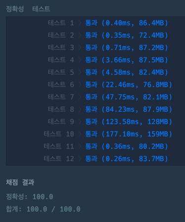

### 풀이 코드
```java
import java.util.*;

class Solution {
    
    public String solution(String number, int k) {
        String answer = "";
        
        Stack<Integer> stack = new Stack<>();
        
        int K = k;
        
        String[] values = number.split("");
        
        for(int i = 0; i < values.length; i++) {
            
            int curValue = Integer.parseInt(values[i]);
            
            if(stack.isEmpty() || k == 0) {
                stack.add(curValue);
            }else {
                if(stack.peek() < curValue) { // 다음수가 큰경우
                    while(!stack.isEmpty() && stack.peek() < curValue && k > 0) {
                        stack.pop();
                        k--;
                    }
                    stack.add(curValue);
                }else if(stack.peek() >= curValue) {
                    stack.add(curValue);
                }
            }
        }
        
        StringBuilder sb = new StringBuilder();
        
        while(stack.size() > number.length() - K) {
            stack.pop();
        }
        
        for(int i = 0; i < number.length() - K; i++) {
            sb.append(stack.pop());
        }
                
        return sb.reverse().toString();
    }
}
```

### 출력 결과
