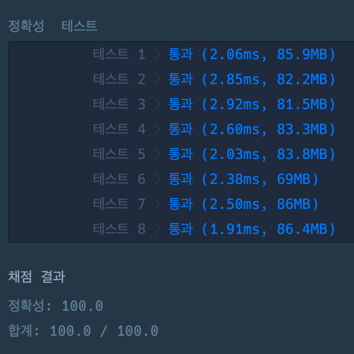

### 풀이 코드
```java
import java.util.*;

class Solution {
    public int solution(int n, int[][] costs) {
        int answer = 0;
        
        List<List<Node>> graph = new ArrayList<>();
        
        for(int i = 0; i < n; i++) {
            graph.add(new ArrayList<>());
        }
        
        for(int[] cost: costs) {
            int start = cost[0];
            int next = cost[1];
            int weight = cost[2];
            
            graph.get(start).add(new Node(next,weight));
            graph.get(next).add(new Node(start,weight));
        }
        
        boolean[] visited = new boolean[n];
        
        PriorityQueue<Node> pq = new PriorityQueue<>(Comparator.comparingInt(node -> node.weight));
        
        pq.add(new Node(0,0));
        
        while(!pq.isEmpty()) {
            Node cur = pq.poll();
            
            if(visited[cur.number]) {
                continue;
            }
            
            visited[cur.number] = true;
            answer += cur.weight;
            
            for(Node nextNode : graph.get(cur.number)) {
                if(!visited[nextNode.number]) {
                    pq.add(nextNode);
                }
            }
        }
        
        return answer;
    }
    
    class Node {
        int number;
        int weight;
        
        public Node(int number, int weight) {
            this.number = number;
            this.weight = weight;
        }
    }
}
```

### 채점 결과
